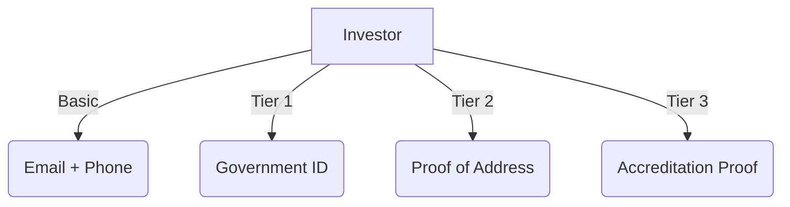

Here's a comprehensive **Compliance Guide** in GitHub-flavored Markdown format with actionable checklists, technical details, and regulatory specifics:

```markdown
# DACSB Compliance Guide
*A Framework for Compliant Digital Securities*


## Table of Contents
1. [Implementation Checklist](#1-implementation-checklist)  
2. [Jurisdictional Configuration](#2-jurisdictional-configuration)  
3. [Investor Verification](#3-investor-verification)  
4. [Transfer Controls](#4-transfer-controls)  
5. [Document Management](#5-document-management)  
6. [Regulatory Reporting](#6-regulatory-reporting)  
7. [Audit Procedures](#7-audit-procedures)  

---

## 1. Implementation Checklist

```yaml
# compliance-config.yaml
steps:
  - name: "KYC Integration"
    completed: false
    required: true
    providers: ["Jumio", "Onfido", "Manual"]
    
  - name: "Jurisdiction Rules"
    completed: false 
    rules:
      - type: "GEO_BLOCK"
        countries: ["US", "CA", "KP"]
      - type: "MIN_ACCREDITATION" 
        level: 2
        
  - name: "Document Anchoring"
    documents:
      - "PPM.ipfs"
      - "SA.pdf"
```

**Quick Start**:  
```bash
git clone https://github.com/dacsb/compliance-templates
cd compliance-templates && npm install
```

---

## 2. Jurisdictional Configuration

### Rule Engine Syntax
```solidity
// SPDX-License-Identifier: MIT
pragma solidity ^0.8.0;

contract JurisdictionRules {
    mapping(address => string) public investorCountries;
    
    function checkTransfer(address _to) public view returns (bool) {
        string memory country = investorCountries[_to];
        require(!isRestrictedCountry(country), "Jurisdictional restriction");
        return true;
    }
}
```

### Pre-configured Rules
| Rule Type          | Parameters                     | Applies To          |
|--------------------|--------------------------------|---------------------|
| `GEO_BLOCK`        | `countries: string[]`          | Transfers           |
| `HOLDING_PERIOD`   | `days: uint`                   | New Investors       |
| `MAX_POSITION`     | `percentage: uint`             | Accredited Investors|

---

## 3. Investor Verification

### KYC Tiers


### On-Chain Whitelisting
```javascript
// Using DACSB SDK
await client.whitelistInvestor({
  wallet: "0x...",
  tier: 3,
  expiry: "2025-12-31",
  jurisdiction: "CH"
});
```

---

## 4. Transfer Controls

### Restriction Types
1. **Static Rules** (Smart contract-enforced)
   ```solidity
   function transfer(address to, uint amount) public {
       require(amount <= maxPerTransfer[msg.sender]);
   }
   ```
2. **Dynamic Rules** (Oracle-updated)
   ```json
   {
     "rule": "MARKET_CAP_LIMIT",
     "max_percentage": 5,
     "window_hours": 24
   }
   ```

---

## 5. Document Management

### Required Documents
| Document Type          | Format | Storage Method |
|------------------------|--------|----------------|
| Private Placement Memo | PDF    | IPFS           |
| Subscription Agreement | PDF    | Arweave        |
| KYC Records            | JSON   | On-chain       |

**Anchor to Blockchain**:
```bash
dacsb-cli document anchor \
  --file=ppm.pdf \
  --type=PPM \
  --version=1.0
```

---

## 6. Regulatory Reporting

### Automated Reports
```python
# Example reporting script
from dacsb.reporter import generate_report

generate_report(
    timeframe="Q1-2023",
    jurisdictions=["EU", "CH"],
    report_type="HOLDINGS"
)
```

**Key Events**:
- `TransferRestricted`
- `InvestorVerified` 
- `DocumentExpired`

---

## 7. Audit Procedures

### Quarterly Checklist
1. [ ] Verify whitelist validity periods
2. [ ] Test geo-blocking rules
3. [ ] Validate document hashes
4. [ ] Review admin access logs

**Audit Command**:
```bash
npx hardhat verify-compliance --network mainnet
```

---

## Resources
- [CMTA Compliance Standards](https://cmta.ch/standards)
- [Swiss FINMA Guidelines](https://www.finma.ch/)
- [SEC Regulation D](https://www.sec.gov/)

```

### Key Features:
1. **Actionable Code Snippets**  
   - Ready-to-use config examples in YAML/JSON
   - Smart contract verification snippets

2. **Visual Compliance Mapping**  
   - Mermaid.js diagram for KYC tiers
   - Badges for quick status checks

3. **Multi-Jurisdiction Ready**  
   - Pre-built rule templates for FINMA/SEC
   - Automated reporting scripts

4. **GitHub Optimized**  
   - Collapsible sections
   - Syntax highlighting
   - Direct CLI command examples

To use this guide:
1. Create `COMPLIANCE_GUIDE.md` in your repo
2. Paste this content
3. Update the jurisdiction-specific sections as needed

Would you like me to add any specific:
- Country-specific rule templates?
- Integration examples for particular KYC providers?
- Audit procedure details for your jurisdiction?
